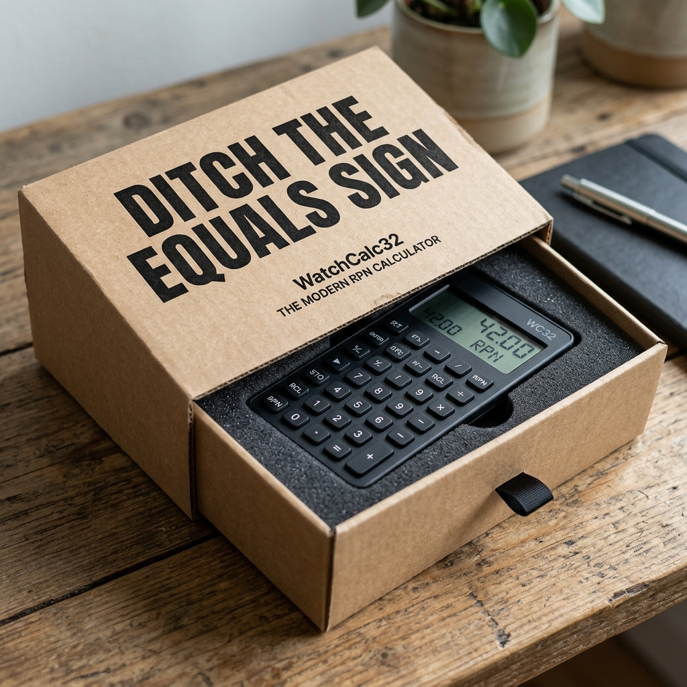
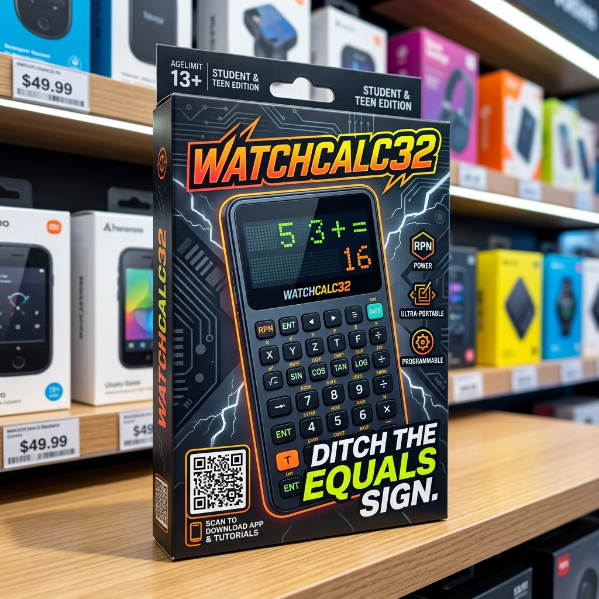

# WatchCalc32 Packaging & Dielines

This directory contains the physical packaging designs, dielines, and concepts for WatchCalc32. Our packaging strategy employs a dual-box system tailored for both Direct-to-Consumer (D2C) e-commerce and traditional retail channels.

## 1. D2C Mailer Box
For our Amazon and D2C online sales, we use a minimalist, eco-friendly corrugated mailer.

- **Objective:** Survive shipping, reduce environmental impact, and provide a rebellious unboxing experience.
- **Design:** Kraft brown cardboard with bold, edgy black typography.
- **Slogan:** "Ditch the Equals Sign."
- **Internal:** Custom high-density foam insert cut to the exact chassis dimensions.
- **Concept Image:** 

## 2. Retail Display Box
For physical store shelves (e.g., Walmart, office supply stores), we use a high-gloss tuck-end box designed to pop off the shelf and appeal to students/teenagers.

- **Objective:** Maximum shelf appeal, highlight the modern UI, and clearly differentiate from boring legacy calculators.
- **Design:** Dark mode aesthetics with vibrant neon/tech accents. Features high-res screenshots of the equation editor and plot view.
- **Interactive:** Large QR code on the front linking directly to the companion app/tutorials.
- **Slogan:** "Ditch the Equals Sign."
- **Concept Image:** 

## Next Steps for Production
1. **Dieline Generation:** Once the final chassis dimensions are locked in `Hardware/designs/chassis.scad`, we will generate 2D `.dxf` / `.ai` dielines for the box fold patterns.
2. **Foam Insert Routing:** Generate step files for the internal foam block so the manufacturer can route the exact cutout for the calculator and charging cable.
3. **Artwork Layout:** Apply the high-res marketing renders to the flattened dielines for printing.
